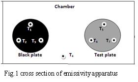

## Procedure

<iframe src="https://www.youtube.com/embed/I_Ruof_H3wo" frameborder="0" allow="autoplay; encrypted-media" allowfullscreen></iframe>

## Apparatus

  
  

Emissivity measurement apparatus: The experimental set up consists of two circular aluminum plates identical in size provide with heater coils at the bottom Fig.1

It is kept in an enclosure so as to provide undisturbed natural convection surroundings. The heat input to the heaters is varied by two regulators and is measured by an ammeter and voltmeter. Each plate is having three thermocouples; hence an average temperature is taken. One thermocouple is kept in the enclosure to read the chamber temperature. One plate is blackened by a layer of enamel black paint to form the idealized black surface whereas the other plate is the test plate. The temperatures of the plates are measured by using thermocouples.

### Variable Region

<ol>
	<li><strong>&nbsp;Choose material </strong>- This can be used to select the specimen plate.</li>
	<li><strong>&nbsp;Diameter of the specimen</strong>- Used to vary the diameter of the specimen in centimeter.</li>
	<li><strong>&nbsp;Thickness of the specimen</strong>- Used to change the thickness of the specimen in centimeter.</li>
	<li><strong>&nbsp;Chamber temperature</strong>- This is used to change the temperature in the evacuated chamber in degree Celsius.</li>
</ol>

### Measurement Region

<strong>White knobs in simulator</strong>- This knob can be rotated by right clicking side arrows and thereby adjusting the voltage and corresponding current which is given as input power.

<strong>Tuning Switch</strong>- Used to turn either Black plate (BP) or Test plate (TP) and thereby can change the corresponding voltage and current for&nbsp; both the plates.

<strong>Note: Power should be given for both the plates must be same.</strong>

<strong>Power on button</strong>- Using this button we can switch on the power when all the initial adjustments were done.

<strong>Temperature indicator in the simulator</strong>- After steady state of temperature is reached (20 minutes in timer). Adjusting the knob by clicking the side arrows in the indicator, thereby T1 to T7 temperature on thermocouples can be noted in degree Celsius.

## Procedure for Simulation

1. From the **Choose Material** drop-down menu, select the material whose emissivity is to be determined (e.g., Brass).

2. Adjust the **Diameter of the Plates** slider to set the required diameter of the plates.

3. Adjust the **Thickness of the Plates** slider to set the required thickness of the plates.

4. Set the desired **Chamber Temperature (°C)** using the **Chamber Temperature** slider.
5. Use the **BP (Black Plate) Selector Switch** to select the **Black Plate**. Rotate the **BP Knob** to set the desired voltage and note the corresponding current displayed on the meter.
6. Change the **BP Selector Switch** to the **Test Plate** position. Adjust the **TP Knob** until the **same voltage** as that applied to the Black Plate is obtained. Ensure that both the Black Plate and the Test Plate are maintained at the same applied voltage before proceeding with the experiment.

7. Click the **POWER ON** button to switch on the emissivity measurement apparatus.

8. After the apparatus is powered on, the **Show Result** checkbox becomes active. Keep it **unchecked** while performing the experiment. It can be selected after completing the experiment to verify the calculated result.

9. Use the **Temperature Point Selector Switch** to select the required temperature measurement point (**T1** to **T7**). The corresponding temperature is displayed on the digital **Temperature Indicator**.
10. Allow the system to reach a steady state after each adjustment. Record the following observations:
   - Voltage (V)
   - Current (A)
   - Temperatures **T1**, **T2**, **T3**, **T4**, **T5**, **T6**, and **T7**

11. Repeat the experiment with different operating conditions or materials, if required.

12. Using the recorded observations, calculate the **emissivity of the selected test plate** using the equations provided in the **Theory** section.

13. (Optional) Select the **Show Result** checkbox to display the emissivity calculated by the simulator and compare it with your manually calculated value.

14. Click the **RESET** button to restore the simulator to its initial state before performing another trial.

---

## Procedure for Real lab

Using emissivity apparatus, the power is given to carry out the experiment using voltmeter and ammeter. After steady state is reached,(2 hours), Using stop watch, every half an hour, the temperature in the temperature indicator is noted. Using trial and error method, T1,T2, T3, T4, T5, T6, and T7&nbsp; are noted. Calculate the value of emissivity for a given test plate using equations.

### Observations and Calculations

Heat emitted by the black body,      

$Q_{b}=\varepsilon_{b}\sigma(T_{b}^{4}-T_{c}^{4})$  $W$

Heat emitted by the test plate,  
$Q_{p}=\varepsilon_{p}\sigma(T_{p}^{4}-T_{c}^{4})$  $W$

$\varepsilon_{b}$ Emissivity of the black plate and it is equal to 1

$\varepsilon_{b}$ Emissivity of the test plate.

$\sigma$ Stefan-Boltzmann constant = $5.67\times 10^{-8}Wm^{-2}K^{-4}$

$T_{b}=\frac{T_{1}+T_{2}+T_{3}}{3}=..........K$

$T_{p}=\frac{T_{5}+T_{6}+T_{7}}{3}=..........K$

$T_{c}$=............K$

$Q_{b}=Q_{p}$ since input power to the two plates is same and conduction heat loss are also same.

Emissivity of the specimen plate, 

$\varepsilon_{p}=\varepsilon_{b}\frac{T_{b}^{4}-T_{c}^{4}}{T_{p}^{4}-T_{c}^{4}}$

### Result

Emissivity of test plate surface =

