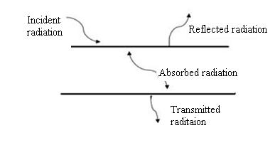
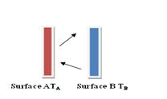

### Theory

<iframe src="https://www.youtube.com/embed/I_Ruof_H3wo" frameborder="0" allow="autoplay; encrypted-media" allowfullscreen></iframe> 

In radiation, energy is carried by the electromagnetic waves emitted by every object. In general, radiation is a volumetric phenomenon. This is because the electrons, atoms and molecules of all solids, liquids and gases above absolute zero temperature are in constant motion and hence energy is constantly emitted, absorbed and transmitted throughout the entire volume of the matter.
 

The radiation from a surface is emitted in all possible directions. A body at a temperature above absolute zero emits radiation in all directions over a wide range of wavelength. The amount of radiation from the surface of a body at a given temperature and at a given wavelength depends on the material of the body and nature of its surface. A concept of an idealized surface has been made which are perfect emitter and absorber of radiation. This ideal surface is known as a black body.

A black body or ideal radiator is a body that emits and absorbs at any temperature the maximum possible radiation at any given wavelength.

A black body has the following features

1. At a specified temperature and wavelength a black body emits more radiation energy than the real one.
2. It absorbs all incident radiation regardless of wavelength and direction
3. It emits radiation energy uniformly in all direction. That is black body is a diffuse emitter the term "diffuse" means independent of direction.

  
  

Depending on type of surface, the reflected radiation is specular or diffuse. A smooth and polished surface is more specular while the rough surface is more diffuse.

The fraction of incident energy absorbed by the surface is called the absorptivity. For a black body it is equal to one.

Actually black body do not exist in nature through its characteristics are approximated by a hole in a box filled with highly absorptive material. The emission spectrum of such a black body was first fully described by Max Planck.

Emissivity of a surface is defined as ratio of the radiation emitted by the surface to the radiation emitted by the black body at the same temperature.

If a sample is replaced by a black body of temperature of same area at same temperature, under thermal equilibrium, the emissivity of the body is equal to the absorptivity.

### Relationship between Absorptivity and Emissivity:

  
  

Consider two flat infinite plates, surface A and surface B, both emitting radiation towards one another. Surface B is assumed to be an ideal emitter $$\varepsilon$$B=1

Surface A will emit radiation according to Stefan's Boltzmann law as

$E_{A}=\varepsilon_{A}\sigma T_{A}^{4}........(1)$

And will receive radiation as 

$G_{A}=\alpha_{A}\sigma T_{B}^{4}.........(2)$

Net heat flow from surface A will be

$$Q=\varepsilon_{A}\sigma T_{A}^{4}=\alpha_{A}\sigma T_{B}^{4}........(3)$$

Now suppose that the two surfaces are at exactly same temperature then $\mu A=\pm A$

Emissivity of surface will depend on the material of which it is composed.
The radiation emitted per unit area per unit time from the surface of a body is called its emissive power. The ratio of emissive power of a body to the emissive power of a black body is called emissivity.

Heat emitted by the black body per unit area,
$$Q_{b}=\varepsilon_{b}\sigma(T_{b}^{4}-T_{c}^{4}).........(4)$$

Heat emitted by the test plate per unit area,

$$Q_{p}=\varepsilon_{p}\sigma(T_{p}^{4}-T_{c}^{4}).........(5)$$

